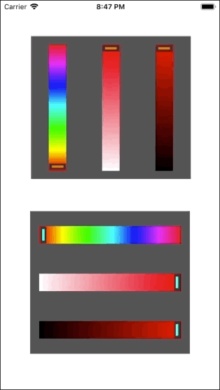

# GCColorSliders
 A flexible multi orientation HSL Color Sliders

 

 # Introduction
 GCColorSliders is created because there seems to be no good and flexible Color Sliders written in
 Objective-C out there. I wanted one that can be added as a small View instead of a whole ViewController.
 What better way to have that than to make it my own :D

 # Usage
 Easy to use.

 1. Drag GCColorSliders.m and .h to your Project in XCode.
 2. Add a placeholder UIView in your storyboard where you want the bar to appear with actual size. Add
 the constraints accordingly. Connect IBOutlet of this view into your header file.
 3. `#import "GCColorSliders.h"` in your header file.
 4. Implement the `GCColorSliders` delegate.
 5. In `viewDidLayoutSubviews` of your viewController, add the following code to create the sliders:
 ```obj-c
    if (_runOnce) { // runOnce is to ensure the sliders are created once (see example project)
      _runOnce = NO;
      GCColorSliders *gcSliders1 = [[GCColorSliders alloc] initWithFrame:self.sliderView.frame
                                                                 andType:GCSLIDER_VERTICAL
                                                                 andTheme:[UIColor orangeColor]];
      [self.view addSubview:gcSliders1];
      [gcSliders1 setBackgroundColor:[UIColor darkGrayColor]];
      gcSliders1.delegate = self; // important!
    }
 ```
 6. Implement delegate function:
 ```obj-c
 -(void)GCColorSlidersColorSelected:(UIColor *)selectedColor {

     // selectedColor is the selected color. duhh...
 }
 ```
 7. Done!

 # Feedback

 If you have questions, give a shout in the Discussion section. If you use this class,
 do send me a link to your app I'd love to see what you created with it.

 -GeneCode-

 Check out my [XCode Tutorial Blog!](https://xcodenoobies.blogspot.com "XCode Tutorial Blog")
